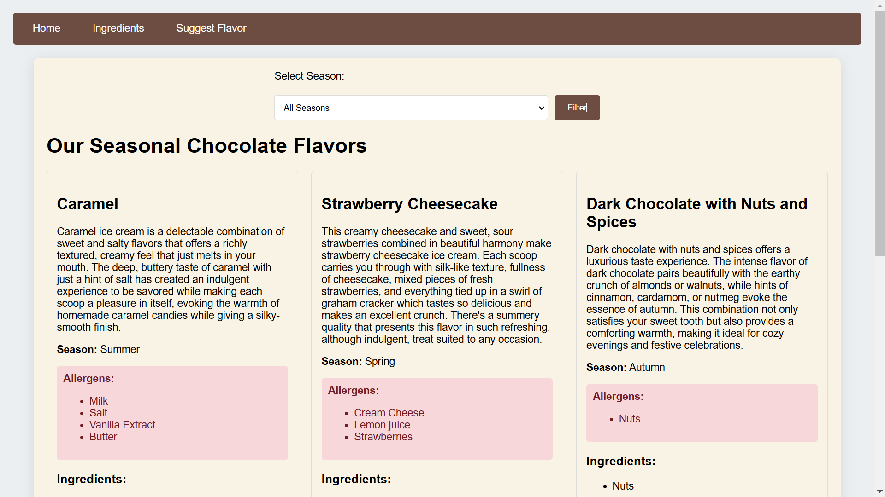
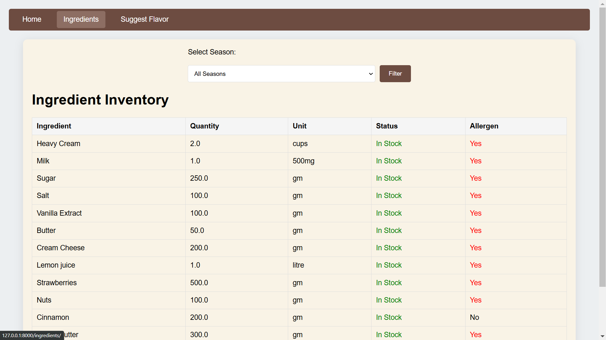
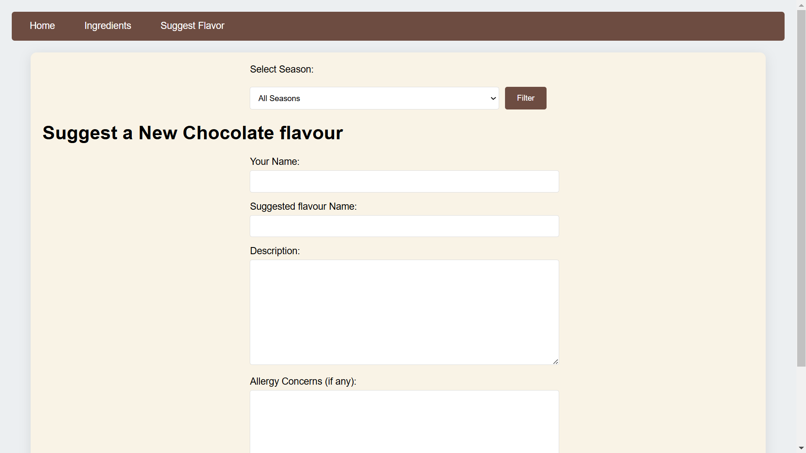
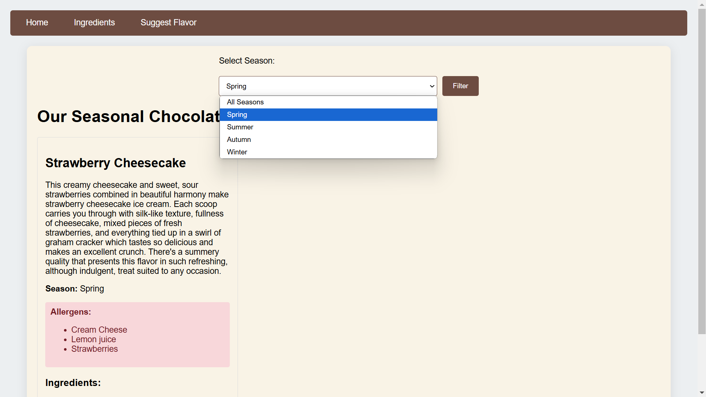

# Chocolate House Management System

A user-friendly application for tracking and managing chocolate ingredients, seasonal chocolate varieties, and gathering customer feedback to enhance your chocolate offerings!

**Author**: Anand Raj
**Date**: 2024-11-05

###  Features

- **Flavor and Seasonal Chocolate Management**  
  View Seasonal Chocolates – Filter available chocolates based on the season (e.g., winter, summer).
- **Ingredients Management**
- 
  View Ingredients by Chocolate – Quickly see which ingredients are used in each chocolate product.

- **Customer Feedback**  
  Collect Suggestions – Gather customer ideas for new flavors, seasonal offerings, or ingredients.

---

###  Tech Stack
- **Django** – Backend framework for robust server-side processing.
- **HTML/CSS** – Frontend design for a user-friendly interface.
- **SQLite** – Simple and effective database for storage and management.

---

### Installation Guide
Follow these steps to set up the application locally:

1. **Clone the Repository**  
   Run the following command to clone the repo:
   ```bash
   git clone https://github.com/anandraj615/Chocolate-House

2. **change the directory**
    ```bash
    cd Chocolate-House
4. **Install Dependencies**
    Navigate to the project directory and install the necessary packages:
    ```bash
    docker-compose build
    docker-compose up
5. **Run the Server**
   ```bash
   Navigating to the development server:
   instead of running 0.0.0.0:8000
   start the project in 127.0.0.1:8000
6. **Screenshots**
   
   
   
   

